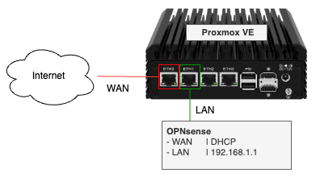

# OPNsense Firewall on Proxmox

In this TechExperiment, we will create an OPNsense firewall as a virtual machine (VM) on Proxmox, using a modem/router from your internet provider configured with DHCP.

## Prerequisites
- A [Proxmox VE (Virtual Environment)](https://proxmox.com/en/downloads) server
- A modem/router from your internet provider with DHCP enabled
- An [OPNsense ISO image](https://opnsense.org/download/)

## Create a New VM for OPNsense
| Step                 | Description |
| -------------------- | ---------------------------------------- |
| **General** | Provide a unique ID and a descriptive name for your VM.|
| **OS** | Choose the OPNsense ISO image you uploaded to Proxmox.|
| **System** | Check the box to enable the Qemu Agent for better VM management.|
| **Disks** | Specify the size and storage location for the virtual disk.|
| **CPU** | Allocate CPU resources: 1 socket, 2 cores, and set the type to "host".|
| **Memory** | Allocate 8 GB of RAM for the VM.|
| **Network** | Configure the LAN interface: use vmbr1, set VLAN to 30, and disable the firewall.|
| **Confirm** | Review your settings and create the VM without starting it.|
| **Add: Network Device** | Add an additional network device for the WAN interface: use vmbr1, set VLAN to 999, and disable the firewall.|

- [Show Details with screenshots](docs/1-create-vm/README.md)

## Install OPNsense

| Step                 | Description |
| -------------------- | ---------------------------------------- |
| **Boot from Installation Media** | Insert the ISO image into the virtual CD/DVD drive of the previously created virtual machine, then power it on. Use the Proxmox console to do the installation. |
| **Start Installation** | Log in as the user `installer` with the password `OPNsense` to proceed the installation. |
| **Select Keyboard Layout** | Choose your preferred keyboard layout from the list. |
| **Configure Disk** | Select the disk where you want to install OPNsense. Choose the appropriate disk formatting option. |
| **Installation Progress** | The installation process will begin. This may take a few minutes. |
| **Change Root Password** | Once the installation is complete, choose the option to change the root password. |
| **Reboot System** | Reboot the system to complete the installation. |
| **Initial Login** | After rebooting, log in as the user `root` and the password you set earlier. |
| **Assign Interfaces** | Assign the network interfaces (e.g., WAN, LAN) as per your network setup. |
| **Initial Configuration** | Your OPNsense firewall is now ready to use! From this point, [continue with the initial configuration](docs/3-initial-opnsense-configuration/README.md) in a browser window. |

- [Show Details with screenshots](docs/2-install-opnsense/README.md)

## Initial OPNsense Configuration

| Step                 | Description |
| -------------------- | ---------------------------------------- |
| **System: Wizard: Login** | Open a browser and go to: `https://192.168.1.1` and log in as the user `root` and the password you set earlier. |
| **System: Wizard: General Setup** | Navigate to System > Wizard, then click `Next` to begin. |
| **System: Wizard: General information** | Provide `hostname` and `domain` and click `Next`|
| **System: Wizard: Time Server Information** | Set the time server hostname (default is fine), set your timezone and click `Next` |
| **System: Wizard: Configure WAN Interface** | IPv4 Configuration Type: DHCP (typical for home networks) |
| **System: Wizard: Configure WAN Interface** | Uncheck `Block private networks` Note: in this Lab the OPNsense Firewall is located after a router from the internet provider. |
| **System: Wizard: Configure LAN Interface**  | Provide LAN IP address and click `Next`  |
| **System: Wizard: Set Root Password** | Click `Next` (Keep the password you set during the installation).  |
| **System: Wizard: Reload Configuration** | Click `Reload` to apply your new configuration.|
| **Finished initial configuration** | Continue with installing [`QEMU Guest Agent for OPNsense`](docs/4-install-qemu-agent/README.md) |

- [Show Details with screenshots](docs/3-initial-opnsense-configuration/README.md)

## Install QEMU Guest Agent

| Step                 | Description |
| -------------------- | ---------------------------------------- |
| **System: Firmware: Plugins** | Search for `qemu` and install `QEMU Guest Agent for OPNsense` |

- [Show Details with screenshots](docs/4-install-qemu-agent/README.md)

## Miscellaneous Settings

| Step                 | Description |
| -------------------- | ---------------------------------------- |
| **System: Configuration: Backups** | Set Backup Count to 500|
| **System: Firmware: Plugins**| Install Plugin `os-theme-vicuna` |
| **System: Settings:  General** | Select `Theme vicuna`

- [Show Details with screenshots](docs/5-miscellaneous-settings/README.md)

## ACME Client 

| Step                 | Description |
| -------------------- | ---------------------------------------- |
| **System: Firmware: Plugins** | Install Plugin `os-acme-client` |
| **Services: ACME Client: Settings** | Set general settings |
| **Services: ACME Client: Accounts** | Add a new ACME account |
| **Services: ACME Client: Challenge Types** | Add a new challenge type DNS-01 |
| **Services: ACME Client: Certificates** | Add a new certificate   |
| **Services: ACME Client: Certificates** | Issue the certificate and monitor its status (pending to OK) |
| **Services: ACME Client: Automations** | Add an automation for certificate management |

- [Show Details with screenshots](docs/6-acme-client/README.md)
