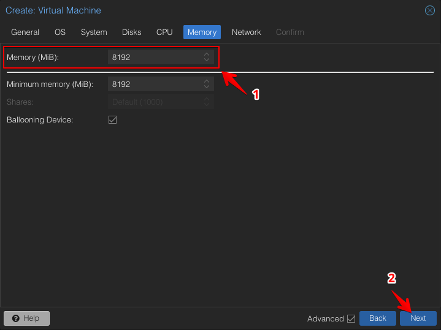
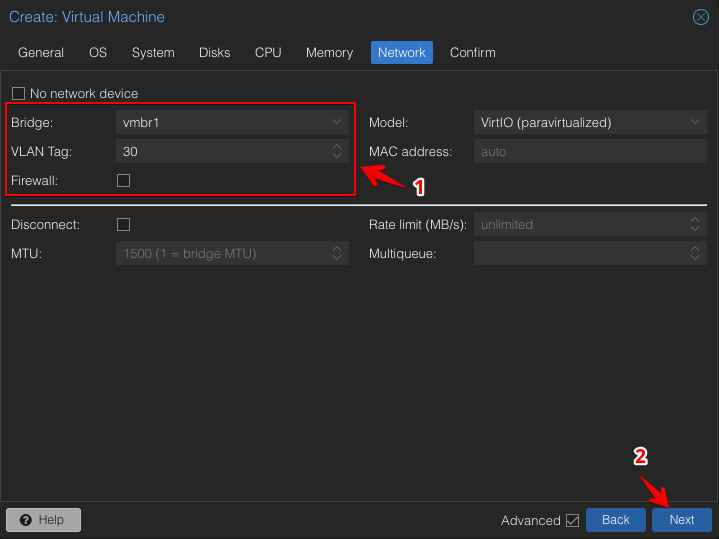
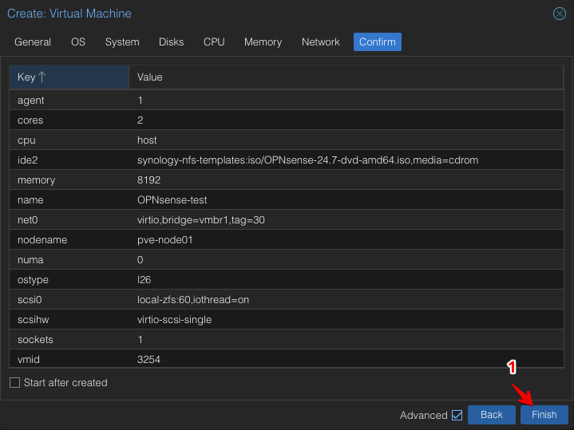

# Create a New VM for OPNsense

## Create: Virtual Machine | General
Provide a unique ID and a descriptive name for your VM. 

## Create: Virtual Machine | OS
Choose the OPNsense ISO image you uploaded to Proxmox.

## Create: Virtual Machine | System
Check the box to enable the Qemu Agent for better VM management.

## Create: Virtual Machine | Disks
Specify the size and storage location for the virtual disk.

## Create: Virtual Machine | CPU
Allocate CPU resources: 1 socket, 2 cores, and set the type to "host".

## Create: Virtual Machine | Memory
Allocate 8 GB of RAM for the VM.

## Create: Virtual Machine | Network
Configure the LAN interface: use `vmbr1`, set VLAN to 30, and disable the firewall.

## Create: Virtual Machine | Confirm
Review your settings and create the VM without starting it.

## Add: Network Device
Add an additional network device for the WAN interface: use `vmbr1`, set VLAN to 999, and disable the firewall.

