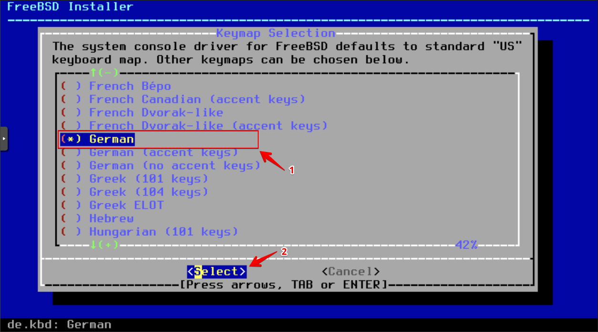

# Install OPNsense

## Boot from Installation Media
Insert the ISO image into the virtual CD/DVD drive of the previously created virtual machine, then power it on. Use the Proxmox console to do the installation.

## Start Installation

Log in as the user `installer` with the password `OPNsense` to proceed the installation.

## Select Keyboard Layout

Choose your preferred keyboard layout from the list.

## Configure Disk

Select the disk where you want to install OPNsense. Choose the appropriate disk formatting option.

## Installation Progress
The installation process will begin. This may take a few minutes.

## Change Root Password

Once the installation is complete, choose the option to change the root password.

## Reboot System

Reboot the system to complete the installation.

## Initial Login

After rebooting, log in as the user `root` and the password you set earlier.

## Assign Interfaces

Assign the network interfaces (e.g., WAN, LAN) as per your network setup.

## Initial Configuration

Your OPNsense firewall is now ready to use! From this point, [continue with the initial configuration](../3-initial-opnsense-configuration/README.md) in a browser window.
