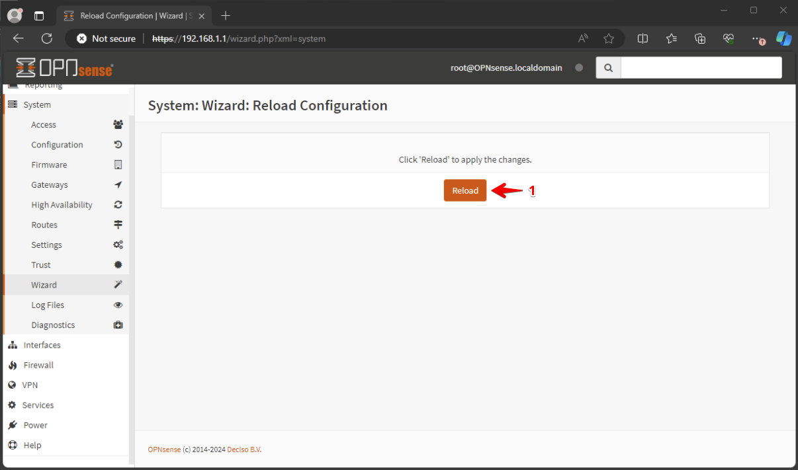
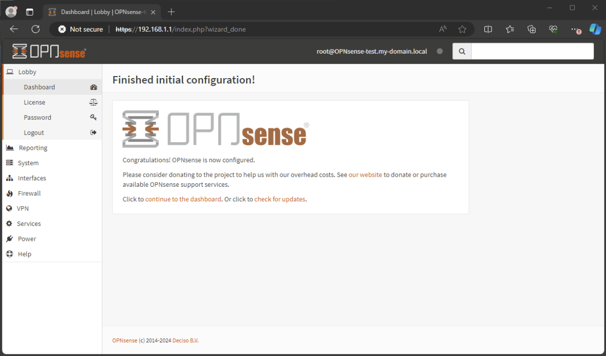

# Initial OPNsense Configuration

## System: Wizard: Login

Open a browser and go to: `https://192.168.1.1` and log in as the user `root` and the password you set earlier.

## System: Wizard: General Setup

Navigate to System > Wizard, then click `Next` to begin.

## System: Wizard: General information

Provide `hostname` and `domain` and click `Next`

## System: Wizard: Time Server Information

Set the time server hostname (default is fine), set your timezone and click `Next`

## System: Wizard: Configure WAN Interface

IPv4 Configuration Type: DHCP (typical for home networks)

Uncheck `Block private networks` 

Note: in this Lab the OPNsense Firewall is located behind a router from the internet provider.

## System: Wizard: Configure LAN Interface

Provide LAN IP address and click `Next`

## System: Wizard: Set Root Password

Click `Next` (Keep the password you set during the installation )

## System: Wizard: Reload Configuration

Click `Reload` to apply your new configuration.

## Next Step

Continue with installing [`QEMU Guest Agent for OPNsense`](../4-install-qemu-agent/README.md)

[Back to Overview](../../README.md)
