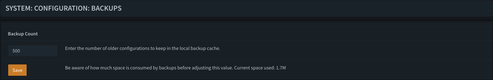
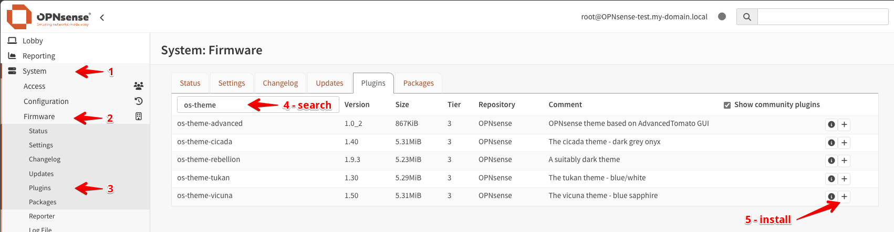
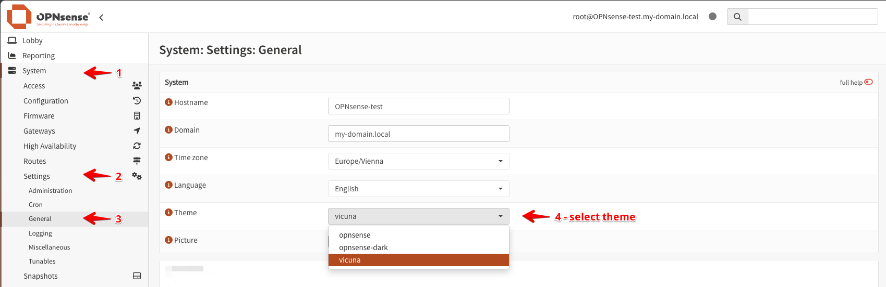

# Miscellaneous Settings

## Backups

Navigate to **System > Configuration > Backups** and set Backup Count to 500

## Configure Theme

Navigate to **System > Firmware > Plugins** and install `os-theme-vicuna`

Navigate to **System > Settings > General** and select `Theme vicuna`

[Back to Overview](../../README.md)