# ACME Client

## Install the ACME Client plugin from System > Firmware > Plugins.

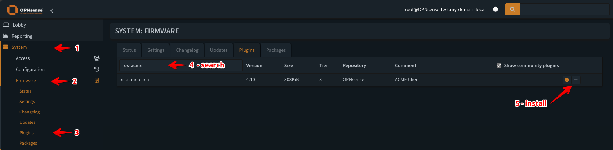

## Open Services > ACME Client > Settings to configure general settings.

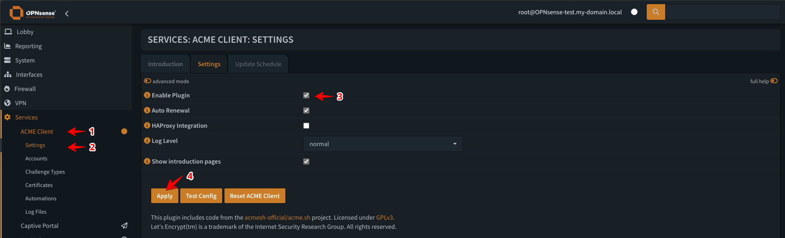

## Add a new ACME account under Services > ACME Client > Accounts.

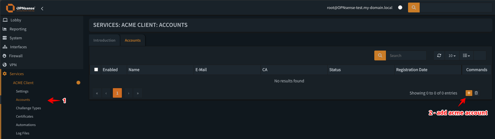

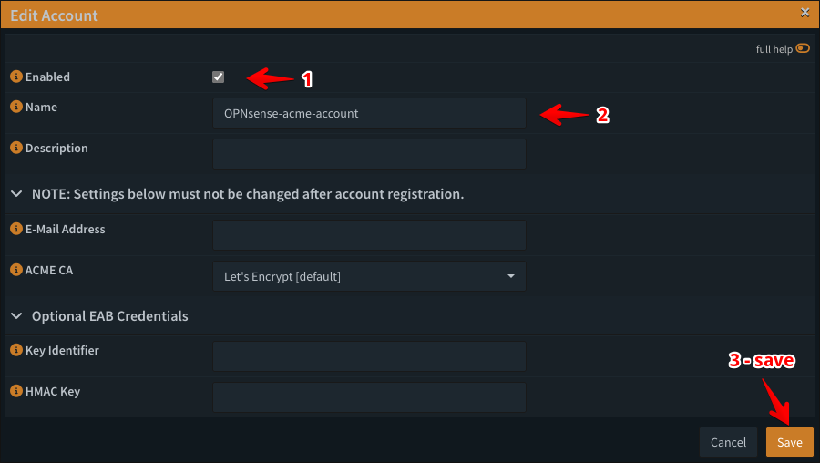

## Add a new challenge type under Services > ACME Client > Challenge Types.

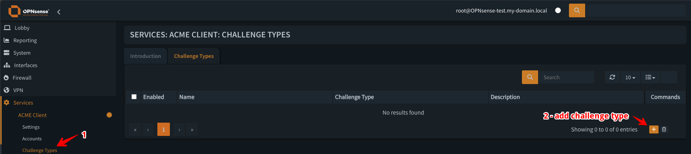

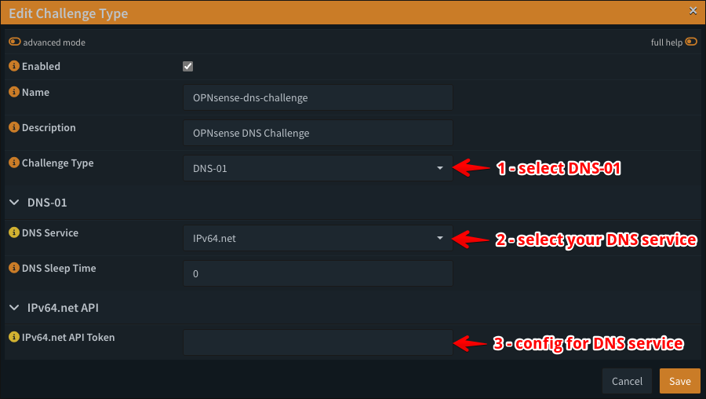

## Add a new certificate under Services > ACME Client > Certificates.

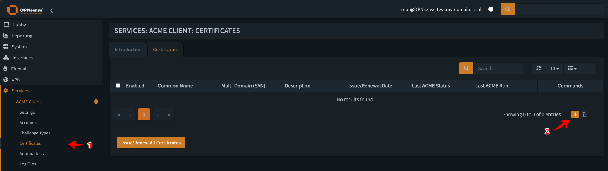

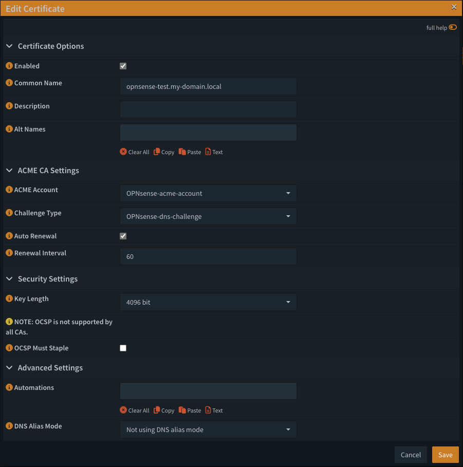

## Issue the certificate and monitor its status (pending to OK).

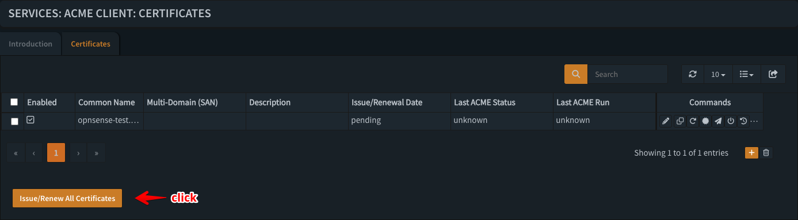

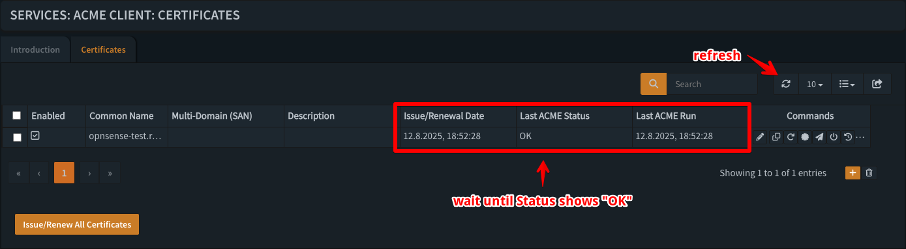

## Add an automation for certificate management under Services > ACME Client > Automations.

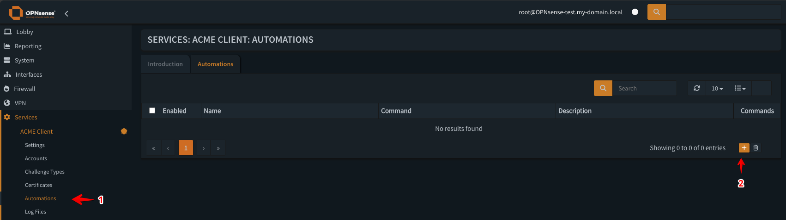

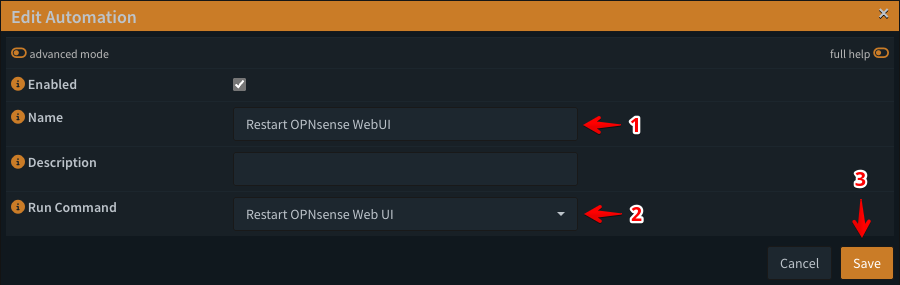

[Back to Overview](../../README.md)