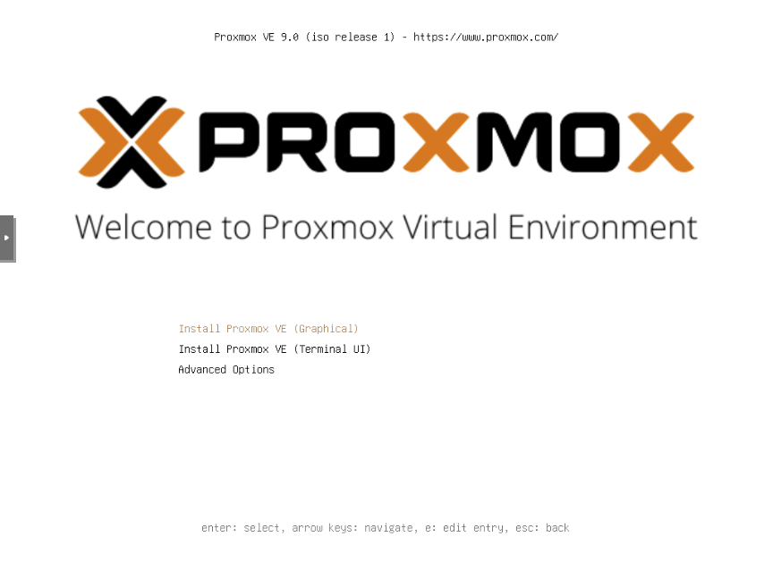
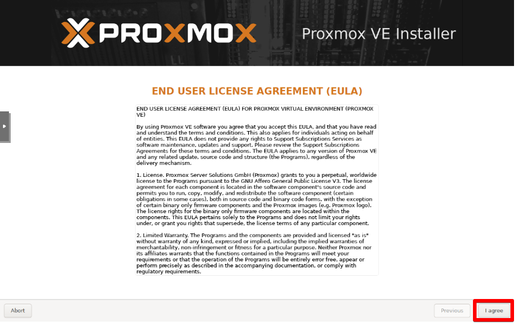
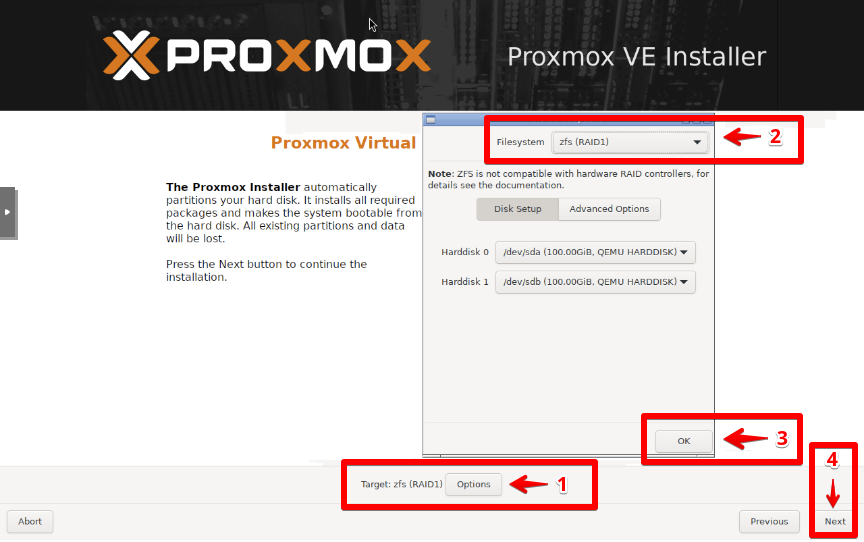
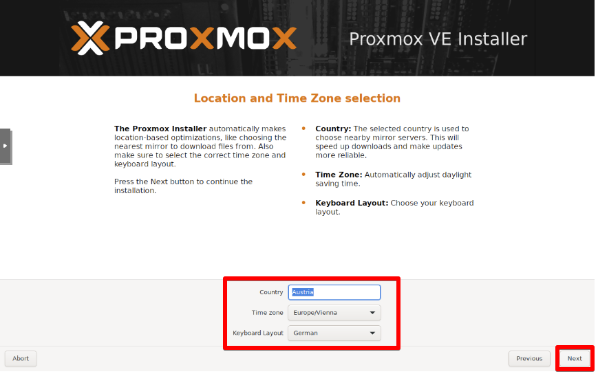
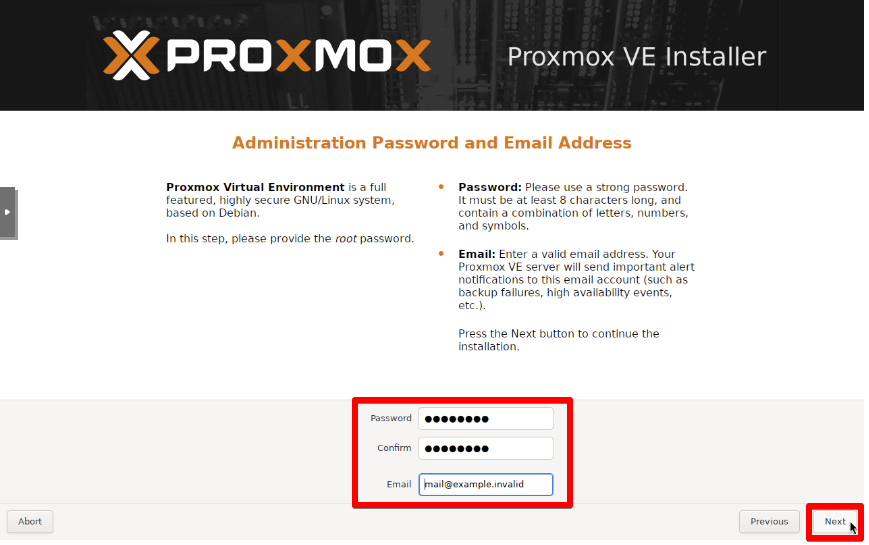
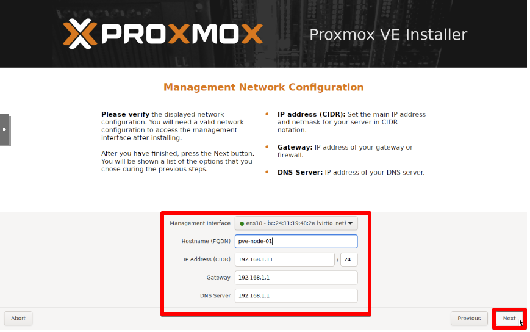
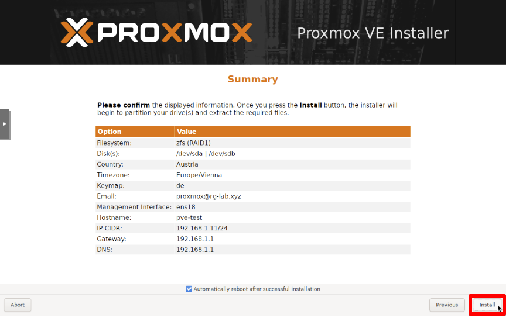

# Setup Proxmox VE

## Prerequisites
- [Proxmox VE (Virtual Environment) installer](https://proxmox.com/en/downloads) 

## Boot Installer from USB

## Agree EULA 

## Define Target Disk

## Define Location and Timezone

## Define Password and E-Mail address

## Define Network Configuration

## Install Proxmox VE

---
[Back to Overview](../../README.md)