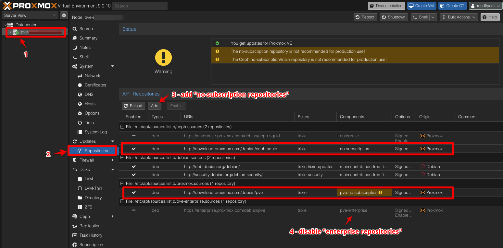
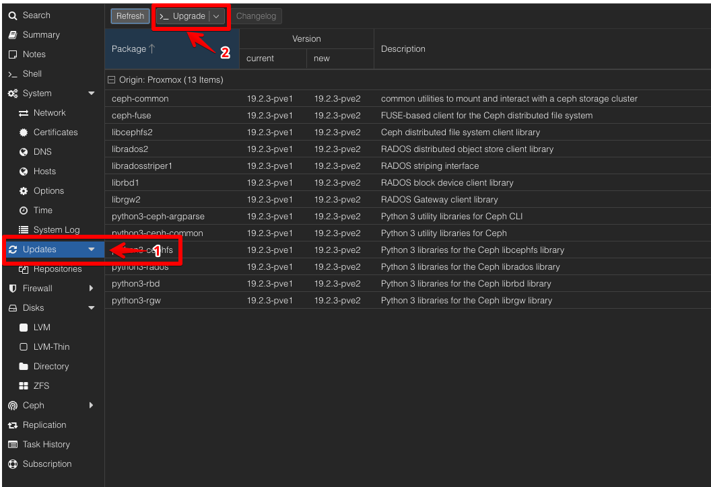

# Initial  Configuration

## Update Repositories

1. Open a browser and go to: `https://192.168.1.11:8006` and log in as the user `root` and the password you set earlier.
1. Navigate to PVE Host > Updates > Repositories
1. Add "no-subsription repositories" for CEPH and PVE
1. Disable "enterprise repositories"

## Update PVE Node
- Navigate to Updates, click button `Upgrade` and install all available packages.

---
[Back to Overview](../../README.md)