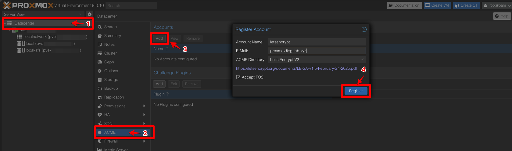
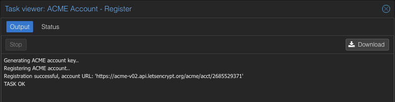
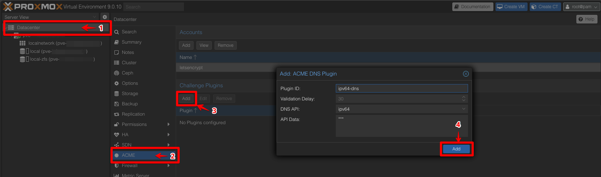
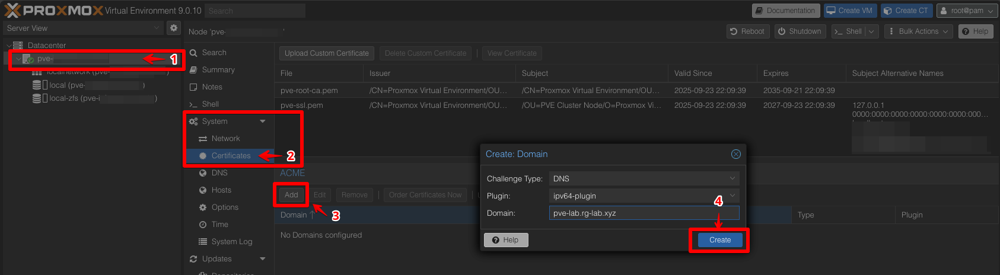
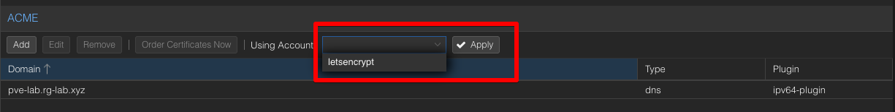
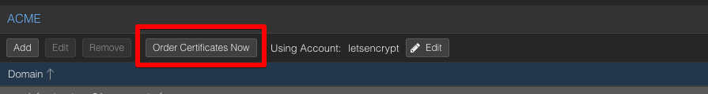

# ACME Certificates

Use the built-in ACME client to automatically request and renew Let's Encrypt certificates for your Proxmox node.

> **Prerequisites**:
> - DNS A record / FQDN exists  
> - API key is available (for DNS challenge)  

> ℹ️ In a cluster, add the ACME account only once in the Datacenter.  
> Each node then requests its own certificate for its individual FQDN.

## Add ACME Account

- Datacenter -> ACME -> Accounts -> Add
- Provide an account name, email address and accept TOS, then click `Register`

## Add Challenge Plugin
- Datacenter -> ACME -> Challenge Plugins -> Add

## Add ACME Certificate
- PVE-Node -> Certificates -> ACME -> Add

---
[Back to Overview](../../README.md)